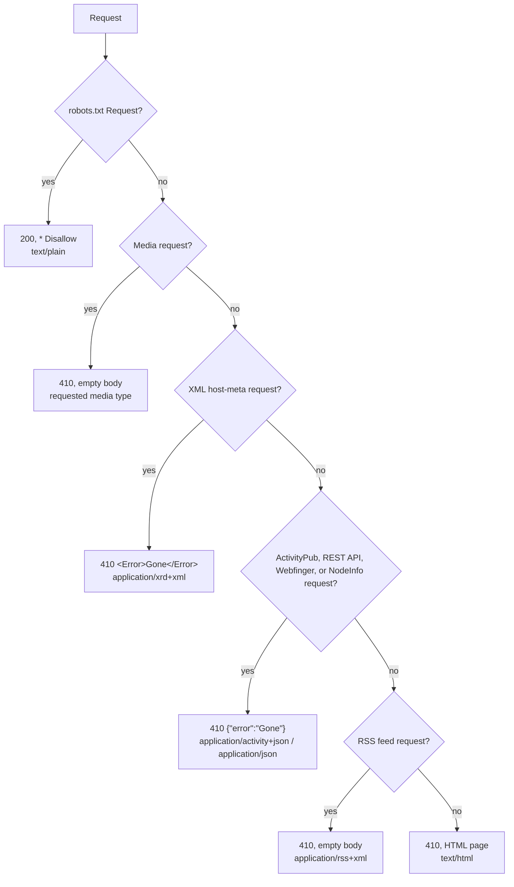

# gone

A tiny Cloudflare Worker that responds to requests with `HTTP 410 Gone` in an
appropriate format including a self-contained Mastodon error page for visitors.

This lets one deployment gracefully retire a Mastodon/ActivityPub instance
and a media/attachment bucket at the same time.

The Mastodon logo is bundled as SVG and inlined into the page as a base64
data URI, so the Worker has no external dependencies and serves a single 410
response per request. It's rasterized onto a `<canvas>` at a higher
resolution than its intrinsic size (for crisp display) and disintegrates into
flying, fading tiles on hover/click — a "Thanos snap" effect. Dark mode
follows the browser's `prefers-color-scheme`.

The HTML page is ~9 KB (~4.2 KB gzipped, handled automatically by
Cloudflare's edge).

The page always displays `vmst.io`, regardless of which hostname routed the
request. Client-supplied forwarding headers are not reflected in the page or
logs.

Example ActivityPub actor fetch:

```sh
curl -i -H 'Accept: application/activity+json' https://your.domain/users/alice
# HTTP/1.1 410 Gone
# Content-Type: application/activity+json; charset=utf-8
# {"error":"Gone"}
```

## Run locally

```sh
pnpm install
pnpm dev
# then visit http://localhost:8787
```

## Test

```sh
pnpm test
```

The Miniflare contract suite covers WebFinger, ActivityPub actor and inbox
requests, media, content negotiation, the retirement-page headers, and the
robots and health endpoints.

```sh
curl -i http://localhost:8787/
# HTTP/1.1 410 Gone
```

## Deploy

Each hostname's zone must already be an active zone in your Cloudflare
account (orange-clouded DNS). Add a `[[routes]]` entry per hostname in
`wrangler.toml` with `custom_domain = true`, then:

```sh
pnpm deploy
```

Wrangler creates/manages the DNS record and certificate for each attached
hostname.

## Content negotiation

Since this is meant to stand in for a decommissioned federated server, most
traffic comes from other servers rather than browsers. The response is chosen
from the request path and headers, checked in this order. Every response is
`410 Gone` **except** `/robots.txt`, which is a live `200` directive:



Every branch returns `410 Gone` except `/robots.txt`, which is a live `200`. A few
notes that don't fit in the diagram:

Body content mostly matters where a *human* reads it. The Mastodon REST API
is consumed by apps (the official web client and third-party clients) that
parse a JSON error's `error` field to show an alert, so it shares that small
JSON body with ActivityPub (inbox deliveries and actor/status fetches) and
the JSON discovery paths (WebFinger, NodeInfo, OAuth/OIDC metadata,
`*.json`) even though most of those are programmatic, status-code-only
consumers — the body is cheap enough that a single shared response is
simpler than special-casing each one. ActivityPub keeps its own
`application/activity+json` Content-Type rather than the plain
`application/json` the other branches use, since that's the representation
those clients actually asked for. host-meta gets the JSON error's XRD/XML
equivalent. Feed responses stay empty, since feed readers never parse a 410
body.

A few more notes that don't fit in the diagram:

- **Media** requests are covered in [Media](#media-former-s3-bucket-requests)
  below.
- **ActivityPub** is matched by path (`/inbox`, including per-actor
  `/users/x/inbox`) or by either the `Accept` or `Content-Type` header being
  `application/activity+json` **or** `application/ld+json` — inbox POSTs may
  omit `Accept` entirely, and actor/status fetches may use either media type.
- **Accept** media types are parsed as individual ranges; `q` weights select
  the preferred recognized representation, and a range with `q=0` is not
  selected. On equal weights, browser HTML remains preferred over media.
- **Mastodon REST API and JSON discovery** are both matched **by path**,
  since these clients (apps, scrapers, OAuth libraries) often send a
  browser-style `Accept` or none at all. `/oauth/authorize` is deliberately
  excluded from the OAuth endpoints, since it's the interactive browser login
  page and still gets the HTML page.
- **Feed** matches are `.rss` only — Mastodon never served an Atom feed — and
  are a dead end for readers that would otherwise keep polling.

All 410 responses carry `Cache-Control: private, max-age=86400` so the
requesting client holds on to the 410 and stops re-requesting a permanently
gone resource. Workers Cache is also enabled in `wrangler.toml`. Every 410
response adds the edge-only
`Cloudflare-CDN-Cache-Control: public, max-age=2592000` header, so Cloudflare can
serve them from its tiered cache without invoking the Worker while browsers
and downstream shared caches still see the private one-day directive. The
30-day edge TTL is safe across changes because Workers Cache keys entries by
Worker version by default. Their existing `Vary: Accept, Content-Type` header
keeps HTML, JSON, ActivityPub, and media representations distinct.

The HTML page is safe to share even though a Worker's cache key does not include
the host because its displayed domain is fixed to `vmst.io`. `/robots.txt`
uses a public one-day cache and needs no `Vary`; `/healthz` is `no-store`.
Only `GET` and `HEAD` are cacheable, so ActivityPub inbox `POST` requests still
invoke the Worker.

The HTML retirement page also sends `X-Robots-Tag: noindex, noarchive,
nosnippet`, a restrictive Content Security Policy, `X-Content-Type-Options:
nosniff`, and `Referrer-Policy: no-referrer`. Its optional logo animation is
disabled for visitors who prefer reduced motion.

### Media (former S3 bucket) requests

A bucket of images/attachments is requested by ``/`<video>` tags and
server-side refetches that ignore any HTML body, so serving the ~9 KB page
for each would waste bandwidth. Such requests get an **empty 410** instead,
with `Content-Type` set to the specific type requested (e.g. `image/png`) so
the client sees the same type it asked for. A request counts as media when
any of:

- the path starts with a Mastodon media prefix — `/media_proxy/`,
  `/media_attachments/`, or `/system/` (these often have no file extension and
  come with a browser-style `Accept`, e.g. hotlinked images); or
- the path ends in a known media extension (`.jpg`, `.png`, `.gif`, `.webp`,
  `.mp4`, `.mp3`, …); or
- the `Accept` header prefers `image/*`, `video/*`, or `audio/*` over the
  recognized HTML or machine-readable alternatives (so a normal browser page
  load, whose `Accept` also lists image types, still gets the HTML page).

The `Content-Type` is taken from the path's extension when it has one of the
known media extensions, otherwise from the highest-quality concrete `image/…`,
`video/…`, or `audio/…` token in `Accept` (for extensionless paths like a
bare `/media_proxy/…` hit).

## Logging

One structured JSON object is logged per Worker invocation via `console.log`,
visible with `wrangler tail` or Logpush, so you can see what is being probed.
Workers Cache hits do not invoke the Worker and therefore do not produce this
log line; cache hits, misses, and bypasses are available in Workers
Observability instead. The Content-Type shows which branch matched:

```json
{"message":"request","status":410,"method":"GET","path":"/users/alice","contentType":"application/activity+json; charset=utf-8","host":"fedi.example","clientIP":"203.0.113.5","userAgent":"TestBot/1.0"}
{"message":"request","status":200,"method":"GET","path":"/robots.txt","contentType":"text/plain; charset=utf-8","host":"example.com","clientIP":"203.0.113.9","userAgent":"Googlebot/2.1"}
```

Fields: message, status, method, path, `contentType`, `host` (requested host),
`clientIP` (`CF-Connecting-IP`, falling back to the first `X-Forwarded-For`
entry), and `userAgent`. Health checks (`/healthz`) are not logged. Set the
`LOG_REQUESTS` var to `"false"` in `wrangler.toml` to disable request logging
entirely.

## Endpoints

- `/*` — returns `410 Gone`; response chosen by path/headers (see above).
- `/robots.txt` — returns `200 OK` with a disallow-all directive.
- `/healthz` — returns `200 OK` for platform health checks (not logged).
