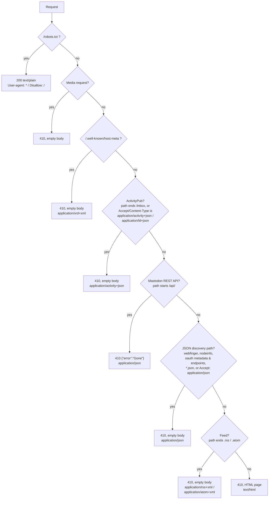

# gone

A tiny Cloudflare Worker that responds to requests with `HTTP 410 Gone` in an
appropriate format including a self-contained Mastodon error page for visitors.

This lets one deployment gracefully retire a Mastodon/ActivityPub instance
and a media/attachment bucket at the same time.

The Mastodon logo is bundled as SVG and inlined into the page as a base64
data URI, so the Worker has no external dependencies and serves a single 410
response per request. It's rasterized onto a `<canvas>` at a higher
resolution than its intrinsic size (for crisp display) and disintegrates into
flying, fading tiles on hover/click — a "Thanos snap" effect. Dark mode
follows the browser's `prefers-color-scheme`.

The HTML page is ~9 KB (~4.2 KB gzipped, handled automatically by
Cloudflare's edge).

The displayed domain is taken from the request (`X-Forwarded-Host`, falling
back to `Host`, with any port and leading `www.` stripped, and the value
HTML-escaped), so a single deployment can serve any number of domains.

Example ActivityPub actor fetch:

```sh
curl -i -H 'Accept: application/activity+json' https://your.domain/users/alice
# HTTP/1.1 410 Gone
# Content-Type: application/activity+json; charset=utf-8
# (empty body)
```

## Run locally

```sh
npx wrangler dev
# then visit http://localhost:8787
```

```sh
curl -i http://localhost:8787/
# HTTP/1.1 410 Gone
```

## Deploy

Each hostname's zone must already be an active zone in your Cloudflare
account (orange-clouded DNS). Add a `[[routes]]` entry per hostname in
`wrangler.toml` with `custom_domain = true`, then:

```sh
npx wrangler deploy
```

Wrangler creates/manages the DNS record and certificate for each attached
hostname.

## Content negotiation

Since this is meant to stand in for a decommissioned federated server, most
traffic comes from other servers rather than browsers. The response is chosen
from the request path and headers, checked in this order. Every response is
`410 Gone` **except** `/robots.txt`, which is a live `200` directive:



Every branch returns `410 Gone` except `/robots.txt`, which is a live `200`. A few
notes that don't fit in the diagram:

Body content only matters where a *human* reads it. The Mastodon REST API is
consumed by apps (the official web client and third-party clients) that parse
a JSON error's `error` field to show an alert — that's the one branch that
gets a real body. Every other branch here is server-to-server or a library
that only ever checks the `410` status (real Mastodon's own WebFinger 410 is
a bare `head 410`, no body; its ActivityPub dereferencer only parses a
response body on `200`), so they get an empty body instead of spending bytes
on content nobody reads.

A few more notes that don't fit in the diagram:

- **Media** requests are covered in [Media](#media-former-s3-bucket-requests)
  below.
- **ActivityPub** `Content-Type` matching also covers AP POSTs that aren't to
  an inbox, not just the shared/per-actor `/inbox` path.
- **Mastodon REST API and JSON discovery** are both matched **by path**,
  since these clients (apps, scrapers, OAuth libraries) often send a
  browser-style `Accept` or none at all. `/api/…` is the highest-volume
  traffic this server sees, so a 17-byte JSON body instead of the ~9 KB page
  is the single biggest bandwidth saving. `/oauth/authorize` is deliberately
  excluded from the OAuth endpoints, since it's the interactive browser login
  page and still gets the HTML page.
- **Feed** matches are a dead end for readers that would otherwise keep
  polling.

All 410 responses carry `Cache-Control: private, max-age=86400` so the
requesting client holds on to the 410 and stops re-requesting a permanently
gone resource, without a shared cache serving one client's response (e.g. a
bot's empty body) to every other visitor.

### Media (former S3 bucket) requests

A bucket of images/attachments is requested by ``/`<video>` tags and
server-side refetches that ignore any HTML body, so serving the ~9 KB page
for each would waste bandwidth. Such requests get an **empty 410** instead. A
request counts as media when any of:

- the path starts with a Mastodon media prefix — `/media_proxy/`,
  `/media_attachments/`, or `/system/` (these often have no file extension and
  come with a browser-style `Accept`, e.g. hotlinked images); or
- the path ends in a known media extension (`.jpg`, `.png`, `.gif`, `.webp`,
  `.mp4`, `.mp3`, …); or
- the `Accept` header asks for `image/*`, `video/*`, or `audio/*` **and** does
  not include `text/html` (so a normal browser page load, whose `Accept` also
  lists image types, still gets the HTML page).

## Logging

One line is logged per request via `console.log`, visible with `wrangler
tail` or Logpush, so you can see what is being probed. The Content-Type shows
which branch matched:

```
410 GET /users/alice ct="application/activity+json; charset=utf-8" host="fedi.example" ip=203.0.113.5 ua="TestBot/1.0"
200 GET /robots.txt ct="text/plain; charset=utf-8" host="example.com" ip=203.0.113.9 ua="Googlebot/2.1"
```

Fields: status, method, path, `ct` (Content-Type), `host` (requested host),
`ip` (`CF-Connecting-IP`, falling back to the first `X-Forwarded-For`
entry), and `ua` (User-Agent). Health checks (`/healthz`) are not logged. Set
the `LOG_REQUESTS` var to `"false"` in `wrangler.toml` to disable request
logging entirely.

## Endpoints

- `/*` — returns `410 Gone`; response chosen by path/headers (see above).
- `/robots.txt` — returns `200 OK` with a disallow-all directive.
- `/healthz` — returns `200 OK` for platform health checks (not logged).
